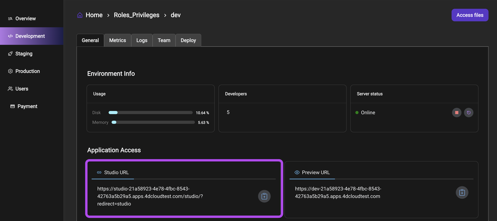
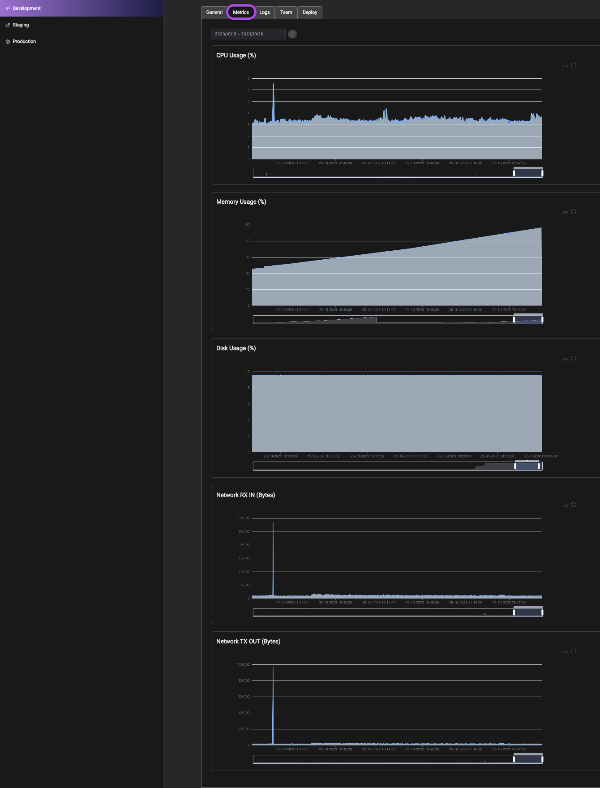

When you click on an application in the Apps list, you open its dedicated panel. You can view the status of every [environment](getStarted.md#environments-and-services):

Click on the left side tabs to control your apps individually for every environment. 

## Stop or restart Qodly Server

This action can be useful to reset the Server memory. 

## Go to Qodly Studio

You can directly open your application instance in Qodly Studio (**Development** and **Staging** [environments](getStarted.md#environments-and-services) only):

- Click on the **Studio** button in the Overview page

- Or,  click on the "Studio URL" in the **General** tab for the open environment:

## Monitor your resources

Click on the **Metrics** tab of an environment to monitor the resources for this environment: 

## Update your Qodly Server 

Click on the cloud icon to update your Qodly Server with latest updates provided by Qodly Platform:

## Invite other developers or users

Click on the **Team** tab to display the list of developers and users who are registered to the application. 

Click on the **Add user** button to invite users:

For every user, you need to provide their "First Name", "Last Name", "Email address", and "Profile". The Profile is a Role you [defined in the application with Qodly Studio](../studio/roles/rolesPrivilegesOverview.md). 

## Schedule and restore your backups

## Preview your app

In the Application Access area, click on the **Preview URL** to open the [home page](../studio/settings.md#start-page) of your application.

## Add custom domain

Per app, you can add your domain to be validated by your DNS. All the information will be provided by QCMC.

## Access to your files through sftp

For every environment, you can access to your files on the server using the **Secure File Transfert Protocol** (sftp). You just need to click on the **Access files** button:

With your favorite ftp client (Filezilla for instance), you can access and manage your files. 

