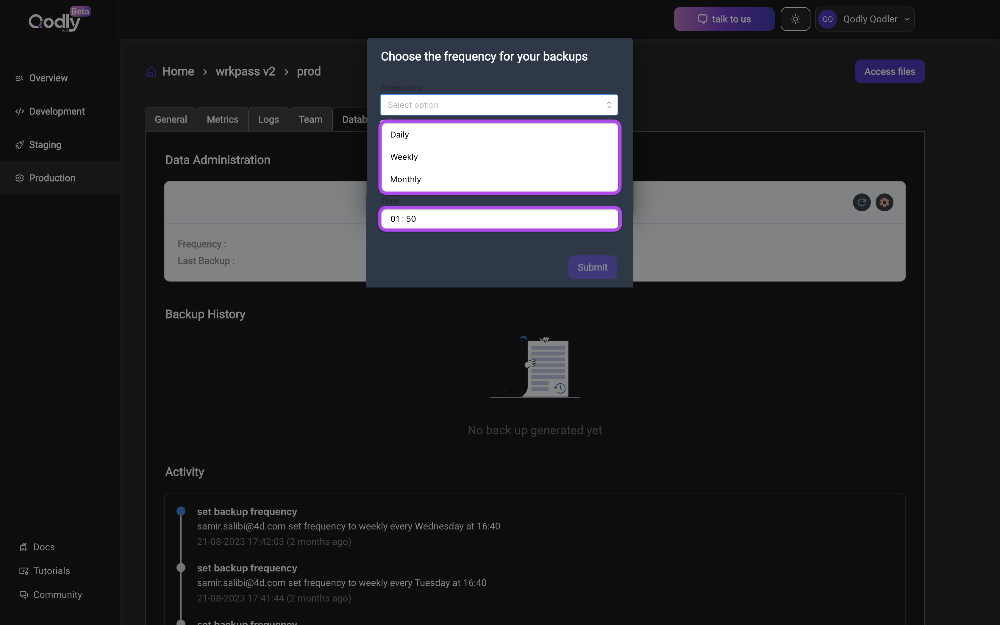

When you select an application from the Apps list, it opens a dedicated panel where you can perform various actions:

## View Environment Status

You have two options to check the status of every environment:

- In the `Overview`, you can see the status of each [environment](getStarted.md#environments-and-services) represented by an icon:

- Alternatively, you can click on the left-side tabs to manage your apps individually for each environment:

## Stop or restart Qodly Server

Useful for resetting server memory.

## Open Qodly Studio

You can directly access your application in Qodly Studio in two ways:

- By clicking the **Studio** button on the Overview page

- Or, by clicking the "Studio URL" in the **General** tab for the current environment.

## Monitor Resources

Access the **Metrics** tab of an environment to monitor its resources.

## Update Qodly Server 

Click the cloud icon to update your Qodly Server with the latest provided by the Qodly Platform.

## Invite Developers and Users

In the **Team** tab, view the list of registered developers and users. Invite users by clicking the **Add user** button and providing their details, including "First Name", "Last Name", "Email Address", and "Profile" (a [role defined in Qodly Studio](../studio/roles/rolesPrivilegesOverview.md)).

## Schedule and Restore Backups

## Preview Your App

Click the **Preview URL** in the Application Access area to open your application's [home page](../studio/settings.md#start-page).

## Add Custom Domain

Per app, you can add a domain for validation (details provided by QCMC).

## Access Files via SFTP

For every environment, access your files on the server using the **Secure File Transfer Protocol** (SFTP) by clicking the **Access files** button.

With your preferred FTP client (e.g., Filezilla), you can access and manage your files.
