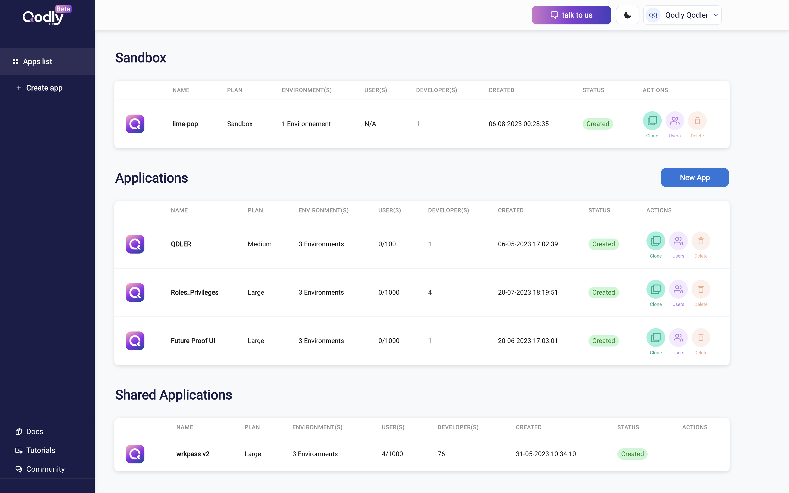

The Qodly Cloud Management Console (QCMC) is the portal from which you can manage all your Qodly applications. 

## Apps list

Once you are [logged to your Qodly account](../concepts/quickstart.md), the QCMC displays all your Qodly applications in a single page:

There are three kinds of Qodly applications:

- **Sandbox**: This is your trial application, where you can let your imagination run wild and experiment with all Qodly's features. This application is only available in the [development environment](../concepts/platform.md#environments-and-services). 
- **Applications**: This area lists all the applications that you have created (except the Sandbox)
- **Shared Applications**: This area lists all the applications created by other developers that they have shared with you (through invitations).
 

## Clone your applications

Instead of starting from scratch, you can clone any of your applications and start a new project based on the same code. 

To clone an application, click on the **Clone** button in the Apps list:

The cloning feature duplicates all your code except your data and resources. 

## Environments and services

For every application, [Qodly Server](../concepts/platform.md#qodly-server) is deployed on three different instances called **environments**: 

- **development**: in this environment, developers can create, design, improve their Qodly application
- **staging**: in this environment, developers, product managers, or quality team can test the application and its features in a configuration similar to the production environment
- **production**: in this environment, users can connect and use your final application. 

Each environment proposes different services:

||Development|Staging|Production|
|---|---|---|---|
|Access to Qodly Studio|X|||
|Invite developers|X|||
|Invite users||X|X|
|Data Backup and Restore|||X|
|Updates|X|X|X|