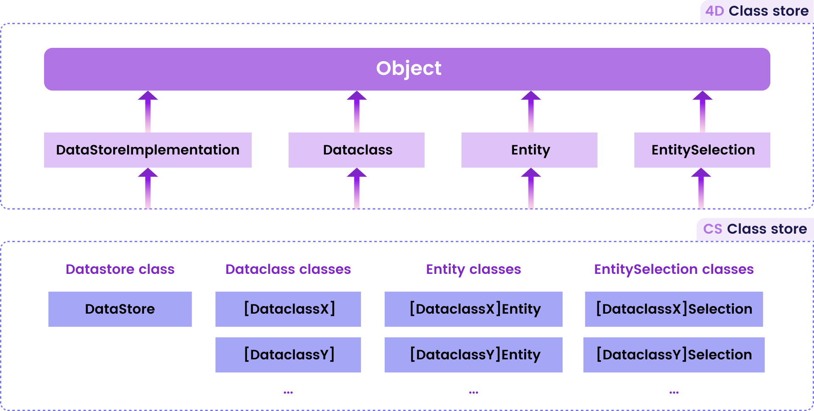
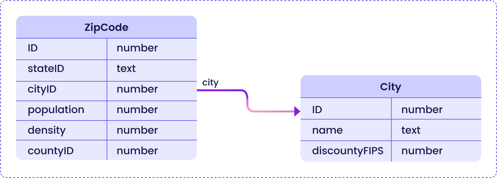

ORDA uses high-level [class](../language/basics/lang-classes.md) functions above the data model. This allows you to write business-oriented code and "publish" it just like an API. Datastore, dataclasses, entity selections, and entities are all available as class objects that can contain functions.

For example, you could create a `getNextWithHigherSalary()` function in the `EmployeeEntity` class to return employees with a salary higher than the selected one. It would be as simple as calling:

```qs
nextHigh=ds.Employee.get(1).getNextWithHigherSalary()
```

Thanks to this feature, the entire business logic of your Qodly application can be stored as a independent layer so that it can be easily maintained and reused with a high level of security:

- You can "hide" the overall complexity of the underlying physical structure and only expose understandable and ready-to-use functions. 
- If the physical structure evolves, you can simply adapt function code and client applications will continue to call them transparently. 
- By default, all of your data model class functions (including [calculated attribute functions](#calculated-attributes)) are **not exposed** to remote calls. You must explicitly declare each public function with the [`exposed`](#exposed-vs-non-exposed-functions) keyword.


## Architecture

ORDA provides **generic classes** exposed through a **`4D`** class store, as well as specific **user classes** (extending generic classes) exposed in the [**`cs`** class store](../language/basics/lang-classes.md):



All ORDA data model classes are exposed as properties of the **`cs`** class store. The following ORDA classes are available:

|Class|Example name|Instantiated by|
|---|---|---|
|cs.DataStore|cs.DataStore|[`ds`](../language/DataStoreClass.md#ds) command|
|cs.*DataClassName*|cs.Employee|[`dataStore.DataClassName`](../language/DataStoreClass.md#dataclassname), `dataStore["DataClassName"]`|
|cs.*DataClassName*Entity|cs.EmployeeEntity|[`dataClass.get()`](../language/DataClassClass.md#get), [`dataClass.new()`](../language/DataClassClass.md#new), [`entitySelection.first()`](../language/EntitySelectionClass.md#first), [`entitySelection.last()`](../language/EntitySelectionClass.md#last), [`entity.previous()`](../language/EntityClass.md#previous), [`entity.next()`](../language/EntityClass.md#next), [`entity.first()`](../language/EntityClass.md#first), [`entity.last()`](../language/EntityClass.md#last), [`entity.clone()`](../language/EntityClass.md#clone)|
|cs.*DataClassName*Selection|cs.EmployeeSelection|[`dataClass.query()`](../language/DataClassClass.md#query), [`entitySelection.query()`](../language/EntitySelectionClass.md#query), [`dataClass.all()`](../language/DataClassClass.md#all), [`dataClass.fromCollection()`](../language/DataClassClass.md#fromcollection), [`dataClass.newSelection()`](../language/DataClassClass.md#newselection), [`entitySelection.drop()`](../language/EntitySelectionClass.md#drop), [`entity.getSelection()`](../language/EntityClass.md#getselection), [`entitySelection.and()`](../language/EntitySelectionClass.md#and), [`entitySelection.minus()`](../language/EntitySelectionClass.md#minus), [`entitySelection.or()`](../language/EntitySelectionClass.md#or), [`entitySelection.orderBy()`](../language/EntitySelectionClass.md#or), [`entitySelection.orderByFormula()`](../language/EntitySelectionClass.md#orderbyformula), [`entitySelection.slice()`](../language/EntitySelectionClass.md#slice)|

Also, object instances from ORDA data model user classes benefit from their parent's properties and functions:

- a Datastore class object can call functions from the [ORDA Datastore generic class](../language/DataStoreClass.md).
- a Dataclass class object can call functions from the [ORDA Dataclass generic class](../language/DataClassClass.md).
- an Entity selection class object can call functions from the [ORDA Entity selection generic class](../language/EntitySelectionClass.md).
- an Entity class object can call functions from the [ORDA Entity generic class](../language/EntityClass.md).


### Specific rules

When creating or editing data model classes, you must pay attention to the following rules:

- Since they are both defined in the **cs** [class store](../language/basics/lang-classes.md#class-stores), do not give the same name to a dataclass and to a user class. If such a case occurs, the constructor of the user class becomes unusable. 
- Do not use a reserved name for a user class (e.g., "DataClass").
- In an ORDA class, `this` designates the instance of the object matching the dataclass.
- You cannot instantiate a data model class object with the `new()` keyword (an error is returned). You must use a regular method as listed in the [`Instantiated by` column of the ORDA class table](#architecture).
- You cannot override a native ORDA class function from the **`4D`** [class store](../language/basics/lang-classes.md#class-stores) with a data model user class function.


## DataStore Class


A database exposes its own DataStore class in the `cs` class store. 

- **Extends**: 4D.DataStoreImplementation 
- **Class name in *cs* class store**: DataStore

You can create functions in the DataStore class that will be available through the `ds` object. 

#### Example

```qs  
// DataStore class

extends DataStoreImplementation

exposed function getDesc
  return "Database exposing employees and their companies"
```


This function can then be called:

```qs
desc=ds.getDesc() //"Database exposing..."
```


## DataClass Class

Each dataclass offers a DataClass class in the `cs` class store.

- **Extends**: 4D.DataClass 
- **Class name in *cs* class store**: *DataClassName*
- **Example name**: Employee


#### Example 1

```qs
// Company class


extends DataClass

// Returns companies whose revenue is over the average
// Returns an entity selection related to the Company DataClass

function getBestOnes() : cs.CompanySelection 
	sel=this.query("revenues >= :1",this.all().average("revenues"))
	return sel
```

Then you can get an entity selection of the "best" companies by executing: 

```qs
	var best : cs.CompanySelection
	best=ds.Company.getBestOnes()
```

:::note

[Calculated attributes](#calculated-attributes) are defined in the [Entity Class](#entity-class). 

:::

#### Example 2

Considering the following model (partial view):



Zipcodes are used as primary keys of the *ZipCode* table. The many-to-one relation attribute between *cityID* and *ID* is named *city*.

The `City Class` provides an API:

```qs  
// City class

extends DataClass

exposed function getCityName(zipcode : integer) -> result : string
	var zip : cs.ZipCodeEntity

	zip=ds.ZipCode.get(zipcode)
	result="" 

	if (zip!=null)
		result=zip.city.name
	end
```

The application can use the API to get the city matching a zip code:

```qs
city=ds.City.getCityName(zipcode)

```


## EntitySelection Class

Each dataclass offers an EntitySelection class in the `cs` class store.

- **Extends**: 4D.EntitySelection 
- **Class name in *cs* class store**: *DataClassName*Selection
- **Example name**: EmployeeSelection


#### Example

```qs
// EmployeeSelection class


extends EntitySelection

//Extract the employees with a salary greater than the average from this entity selection 

function withSalaryGreaterThanAverage() -> result : cs.EmployeeSelection
	result=this.query("salary > :1",this.average("salary")).orderBy("salary")

```

Then you can get employees with a salary greater than the average in any entity selection by executing: 

```qs
moreThanAvg=ds.Company.all().employees.withSalaryGreaterThanAverage()
```

## Entity Class

Each dataclass offers an Entity class in the `cs` class store.

- **Extends**: 4D.Entity 
- **Class name in *cs* class store**: *DataClassName*Entity
- **Example name**: CityEntity

#### Calculated attributes

Entity classes allow you to define **calculated attributes** using specific keywords:

- `function get` *attributeName*
- `function set` *attributeName*
- `function query` *attributeName*
- `function orderBy` *attributeName*

For more information, please refer to the [Calculated attributes](#calculated-attributes) section. 


#### Example


```qs
// cs.CityEntity class

extends Entity

function getPopulation() -> result : integer
    result=this.zips.sum("population")


function isBigCity() -> result : boolean
// The getPopulation() function is usable inside the class
result=this.getPopulation()>50000
```

Then you can call this code: 

```qs
var city : cs.CityEntity
var message : string

city=ds.City.getCity("Caguas")

if (city.isBigCity())
	message=city.name + " is a big city"
end
```


