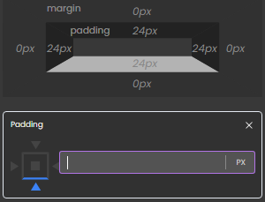

## Server-side reference

The server-side reference of a component is its "address" on the server. To set the behavior of a component, you can give it a server-side reference, and then [use that reference in class functions](../../language/WebForm.md).

To assign a server-side reference to a component, enter a value in the Properties panel > Server Side:

### Class

This area allows you to apply default or custom CSS class(es) to the selected component. When you select or enter a CSS class name, the CSS is applied to the component and its name is displayed under the area. Involved style and color properties are updated accordingly in the panel, allowing you to alter some parts of the CSS.

You can apply more than one CSS, [Cascading and inheritance rules](https://developer.mozilla.org/en-US/docs/Learn/CSS/Building_blocks/Cascade_and_inheritance) will be applied. 

To remove a CSS from the component, just click the `x` at the right side of the CSS label. 

### Text Color and Background

Text and Background color of the selected component. For each property, you can:

- enter a rgb value with the syntax `rgb(<number>,<number>,<number>)`
- enter a hexadecimal color value such as `#cf737300`
- click on the color picker button and select a color; its hexadecimal value is then inserted in the area. 

### Height and Width

Height and Width of the selected component. You can use these properties to modify the component's size. You can change the [unit](#display-unit) for these properties. 

### Margin and Padding

This area allows you to define the margin and padding values for the selected components. When you click on a padding or a margin, an additonal area is displayed, so that you can enter or display values.   

  

### Display

:::info

This property is only available for a whole webform.

:::

Overall display organization of components within the webform. 

  

The following options are available:

- **Block** (default): components are displayed sequentially from top to bottom, without specific settings.
- **Flex**: components are displayed depending on a defined schema that includes multiple customized parameters (alignment, gap between components, justification, wrap). When you select this option, an additional area is displayed so that you can modify any relevant parameters. 

  

- **None**: components are hidden.

### Display unit 

CSS size properties such as "Height" & "Width" are expressed using the `PX` (pixels) default display unit. You can modifiy this unit using the menu at the right side:

  

For a description of these units, you can refer to [this page](https://developer.mozilla.org/en-US/docs/Learn/CSS/Building_blocks/Values_and_units#lengths).
