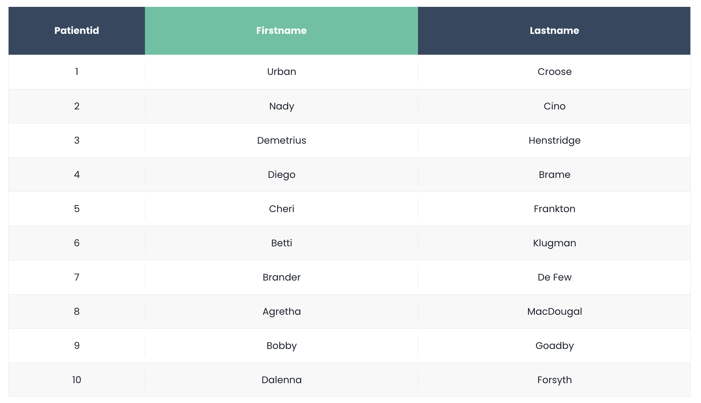
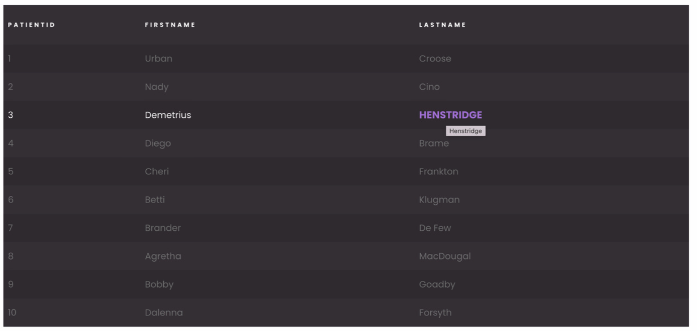

import Column from '@site/src/components/Column'

After placing a component on the Canvas, you have the freedom to tailor its appearance using a variety of styling tools.

## Overview 

The Styles Library provides a powerful way to style your components. You can do this by simply dragging CSS classes from the Styles Library and dropping them onto the components.

The Styles Library provides three distinct types of CSS classes: 

<Column.List align="center" justifyContent="between">
	<Column.Item width="55%">
        <ul>
          <li><strong>Local</strong>: These CSS classes are specific to the Webforms in which they are created and do not have an icon next to them.</li>
          <li><strong>Theme</strong>: Predefined CSS classes designed for standard themes, which can be applied across all Webforms in your application. You can recognize them by this icon .</li>
          <li><strong>Shared</strong>: CSS classes that are shareable and can be used across all Webforms within your application. These are identifiable by this unique icon .</li>
        </ul>
	</Column.Item>
	<Column.Item width="40%">
    
	</Column.Item>
</Column.List>

## Managing CSS Classes 

### Adding a CSS Class

To add a CSS class, click the  button, give it a name, and then choose the appropriate type:

<Column.List align="center" justifyContent="between">
	<Column.Item width="55%">
        <ul>
          <li>For a <strong>local CSS class</strong>: Leave the "Create as Shared" option unchecked. </li> <br/>
          <li>For a <strong>shared CSS class</strong>: Check the "Create as Shared" option.</li>
        </ul>
	</Column.Item>
	<Column.Item width="40%">
    
	</Column.Item>
</Column.List>

:::info
<Column.List align="center" justifyContent="between">
	<Column.Item width="55%">
    An alternative method to establish a new CSS class is through the properties panel, within the Style category. You can input your desired name, for example "newCssClass", into the CSS field. <br/>
    If this name doesn't correspond to any existing CSS classes, you will be prompted with the option to create a new one.
	</Column.Item>
	<Column.Item width="40%">
    
	</Column.Item>
</Column.List>
:::

### Editing a CSS Class

<Column.List align="center" justifyContent="between">
	<Column.Item width="60%">
    To edit a CSS class code, click the edit button  within the Styles Library next to the class's name. This action will open it in the contextual panel.
	</Column.Item>
	<Column.Item width="30%">
    
	</Column.Item>
</Column.List>

- Both **Local** and **Shared** CSS class codes can be modified in the [Contextual panel](../design-webforms/create-webform#contextual-panel) at the interface's bottom.

  

<br/><br/>

:::info
The changes will affect all the components utilizing this CSS class.
:::


- <Column.List align="center" justifyContent="between">
	<Column.Item width="55%">
    <strong>Theme</strong> classes, however, are non-editable, they can only be viewed by clicking on the  button next to their name in the Styles Library.
	</Column.Item>
	<Column.Item width="40%">
    
	</Column.Item>
</Column.List>


:::info
<Column.List align="center" justifyContent="between">
	<Column.Item width="55%">
    An alternative approach to edit a CSS class is to navigate to the Style category, where you can check which CSS classes affect your component and access them using the edit button .
	</Column.Item>
	<Column.Item width="40%">
    
	</Column.Item>
</Column.List>
:::

### Renaming a CSS Class

Inside the Contextual panel, you'll find a field with the class name  and an edit button  next to it. Click on it to rename the class.

:::info
Theme CSS classes cannot be renamed.
:::

### Deleting a CSS Class 

To remove a CSS class, click the delete button  next to its name in the Styles Library.

:::info
Theme CSS classes cannot be deleted.
:::

### Converting a Local CSS Class to Shared

Inside the Contextual panel, you'll find a field with the class name  and a share button  next to it. Click on it to transform a local CSS class into a shared one.

### Tracking CSS Classes Usage

<Column.List align="center" justifyContent="between">
	<Column.Item width="55%">
    The <strong>Inspect</strong> option allows you to see where your CSS classes are used within your webforms. 
	</Column.Item>
	<Column.Item width="40%">
    
	</Column.Item>
</Column.List>

<Column.List align="center" justifyContent="between">
	<Column.Item width="35%">
    Toggle the option by clicking the button, then hover over a CSS class to highlight its location in your webform.
	</Column.Item>
	<Column.Item width="60%">
		
	</Column.Item>
</Column.List>

## Properties panel

The Properties panel gives you extremely granular control over your elements. 

After you select an element, you can edit its properties using this panel. This includes style properties (as a rule, component properties and styling are separated).

Using the Properties panel, you can bind a CSS class to the element and define values individually.


Some visual properties such as DataTable columns can be edited directly on the canvas.

### Example 

To add a red background to a Button component: 

* from the Styles library:
drag the `bg-red-500` class from the Styles library and drop it on the Button component.

* using the Properties Panel:
    * select the Button component, and under Style, choose a red color for the background.
    * select the Button component, then in the Properties panel, select the `bg-red-500` class in the CSS section.

## Overriding style properties

Selecting a component displays its style properties in the Properties Panel. Values set by CSS classes are displayed in italics. For example, assigning the `bg-red-500` class to the component will get the Background property to display *rgb(239,68,68)*.

Modifying these values overrides the initial value for that property. Overriden CSS properties have a blue dot in front of them. 

You can export the new values to create a new CSS class.

## Working with CSS 

### Exporting styles as CSS classes for reuse 

You can export the style of an element as a CSS class to reuse it later: 
1. Select a an element on the canvas, the tooltip appears.
2. Click the CSS icon in the tooltip and enter a name for the new CSS class. 
3. If you want to export a shared CSS, check the **Export as shared** option.
4. Click **Export**.

:::note

This does not export all the styles of the component, only the properties you override.

:::

This exports the [new style properties](#overriding-style-properties) of the element as a new local or shared CSS class. Now it appears as a choice in the Styles library and in the property list, and you can apply the class to other elements on your canvas. 

### Naming CSS classes

If both a shared and a local CSS classes have the same name:
- in the Webform source, the shared CSS is placed first and the local one is placed in second
- as a result, if one of them is applied to a component, they are both applied and some local CSS properties may override the shared ones.


## Customizing DataTable Styles

The [DataTable component](components/datatable.md) styles can be highly customized thanks to the support of specific CSS classes adressing all parts of the table:


### CSS table 

The following specific css classes are supported:

|Area|Class name|Applies to|
|---|---|----|
|Header|.header|the whole header|
||.header-cell|all the cells of the header|
||.header-even|header of even columns|
||.header-datasourceName (*)|the header of the corresponding datasource|
|Row|.row|all rows|
||.selected|the selected row|
||.row-even|all even rows|
||.hover|the hovered row|
|Cell|.cell|all the cells|
|Column|.col-datasourceName (*)|the column of the corresponding datasource|
||.col-even|even columns|
||.sorted|sorted colums|
||.sorted-asc|asc sorted columns|
||.sorted-desc|desc sorted columns|

(*) Ex: .header-lastname, .header-employer-name (use a - instead of . for relations)

### Examples

The following CSS definitions allow to design custom datatable components.

#### Example 1


```css
self {
  border-radius: 10px;
  box-shadow: 0 0 40px 0 rgb(0 0 0 / 15%);
}

self .header .header-cell {
  background-color: #6c7ae0;
  color: #fff;
  font-weight: bold;
  padding: 1.25rem 2rem;
}

self .row {
  align-items: center;
}

self .row .cell {
  padding: 0.5rem 2rem;
}

self .row .cell > span {
  justify-content: flex-start;
}

self .row.selected {
  background-color: #d2d7f5;
}

self .row-even:not(.selected):not(:hover) {
  background-color: #f8f6ff;
}

self .header .resizable > :not([hidden]) ~ :not([hidden]),
self .row > :not([hidden]) ~ :not([hidden]),
self .Grid .innerScrollContainer,
self .Grid .innerScrollContainer > :not([hidden]) ~ :not([hidden]) {
  border-width: 0;
}

```


#### Example 2



```css
self .header .header-cell {
  background-color: #324960;
  color: #fff;
  font-weight: bold;
  font-size: 14px;
  display: flex;
  align-items: center;
  justify-content: center;
}

self .header .header-even {
  background-color: #4fc3a1;
}

self .row {
  align-items: center;
}

self .row .cell {
  font-size: 14px;
  text-align: center;
}

self .row .cell > span {
  justify-content: center;
}

self .row.selected {
  background-color: #caede2;
}

self .row-even:not(.selected):not(:hover) {
  background-color: #f8f8f8;
}

self .header .resizable > :not([hidden]) ~ :not([hidden]),
self .row > :not([hidden]) ~ :not([hidden]),
self .Grid .innerScrollContainer,
self .Grid .innerScrollContainer > :not([hidden]) ~ :not([hidden]) {
  border-width: 0;
}
```

#### Example 3

This example requires that the DataTable contains a column associated to a `lastname` datasource.



```css
self {
 background-color: rgb(61, 54, 61);
}

self .row {
  align-items: center;
}

self .header {
 font-weight: bold;
}

self .header .header-cell {
 background-color: transparent;
 border-top: none;
 border-bottom: none !important;
 color: #fff;
 font-size: 11px;
 text-transform: uppercase;
 letter-spacing: .2rem;
}

self .row {
 background-color: rgba(0, 0, 0, 0.1);
 color: #777;
 transition: 0.3s all ease;
}

self .row:hover {
 background-color: rgba(0, 0, 0, 0.1);
 color: white;
}

self .row:hover .col-lastname {
 color: #b474e4;
 font-weight: bold;
 font-size: 18px;
 text-transform: uppercase;
}

self .row.row-even {
 background-color: unset;
}

self .row .cell > span {
  justify-content: flex-start;
}

self .header,
self .header .resizable > :not([hidden]) ~ :not([hidden]),
self .row > :not([hidden]) ~ :not([hidden]),
self .Grid .innerScrollContainer,
self .Grid .innerScrollContainer > :not([hidden]) ~ :not([hidden]) {
  border-width: 0;
}
``` 


## See also

If you're not familiar with CSS properties and styles, or you need a refresher, here are a few useful links and tools:

* Learn CSS on the [MDN website](https://developer.mozilla.org/en-US/docs/Learn/CSS/Building_blocks/Cascade_and_inheritance)
* A guide to [flexbox properties](https://css-tricks.com/snippets/css/a-guide-to-flexbox/) on css-tricks.com
* [Box-shadow examples](https://getcssscan.com/css-box-shadow-examples), [box-shadow generator](https://cssgenerator.org/box-shadow-css-generator.html)