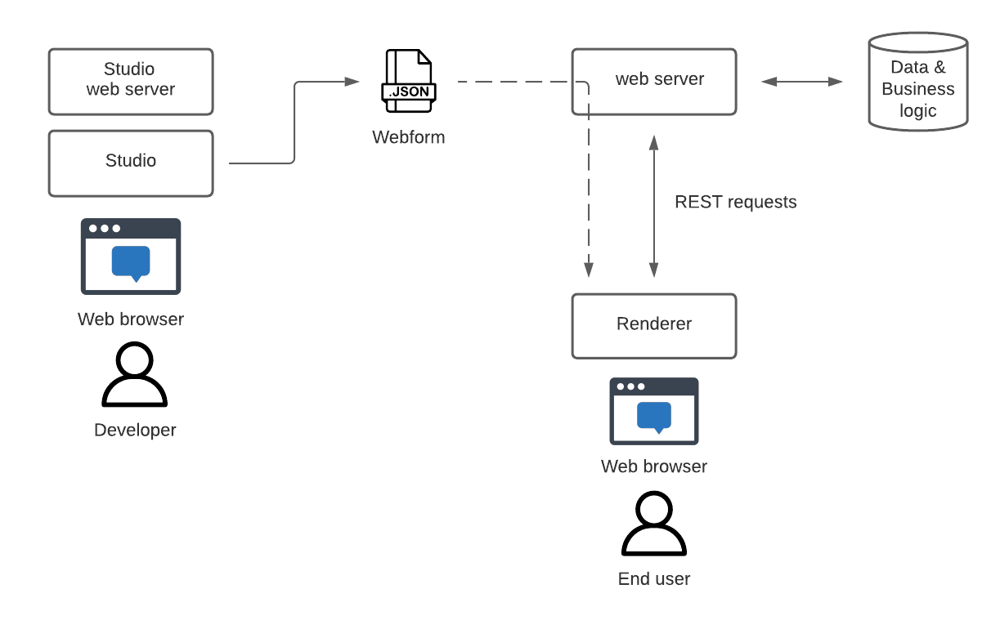
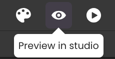
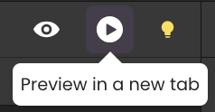

A webform describes your application's look and behavior. After or while you design a webform, you can *render* it to see its final result.

## Overview

Qodly Studio does not generate HTML code directly. When you drop components on the canvas, when you map datasources to components, or when you configure an event, Qodly Studio places your work in a JSON file. This JSON file, the webform, cannot directly be opened in a web browser. It is "rendered" either when you preview it in the Studio, or when you choose to render it in a dedicated browser tab.

At runtime, webforms are generated and interpreted by the built-in renderer engine.

Each webform has its own URL on the Qodly Web server.

The following diagram describes how data flows to and from the studio:

* The embedded Studio web server provides a secured web access and allows previewing webforms inside Qodly Studio.
* The Qodly web server is exposed as REST server and the renderer communicates with it using REST requests.
* The webforms are deployed with the application, and end-users render them in their browsers. 

## How to render a webform

Webforms can be rendered in the Qodly Studio IDE or in a browser window. Note that the database resource access control will or will not be applied to the rendered page(s) depending on the renderer. Preview buttons are all available from the webform editor.

### Preview in studio

This button allows you to render the current page directly in the webform editor window. 

In this case, the webform is rendered by the Qodly Studio embedded web server. This allows you to see all dataclasses, functions and attributes, even if they are not exposed as REST resources (they are greyed out), or even if permission actions are configured.
Note that such preview is done with **Admin** privileges, and uses the **Admin** account you registered with. To preview your application or a given webform with actual users privileges, use **Preview form in a new tab** or **Preview (all site**).

### Preview in a browser window

You can render the current webform or the whole website in a browser window. In both cases, the webform is rendered by Qodly web renderer engine. The renderer engine **applies the REST resource restrictions and permission actions** that might have been configured defined in your Qodly project. This means that only exposed resources are rendered in the browser. 
Note that such preview is done with the logged in user's privileges. At your first preview, or when your session has expired, your browser will ask to log in with a Qodly user account, and use this account's privileges to render your application.

#### Preview form in a new tab

This button allows you to display the current webform in a browser window tab.

#### Preview (all site)

The **Preview** button of the Qodly toolbar displays the start page which is [defined in the Settings](settings.md/#application) in a browser window tab. 

